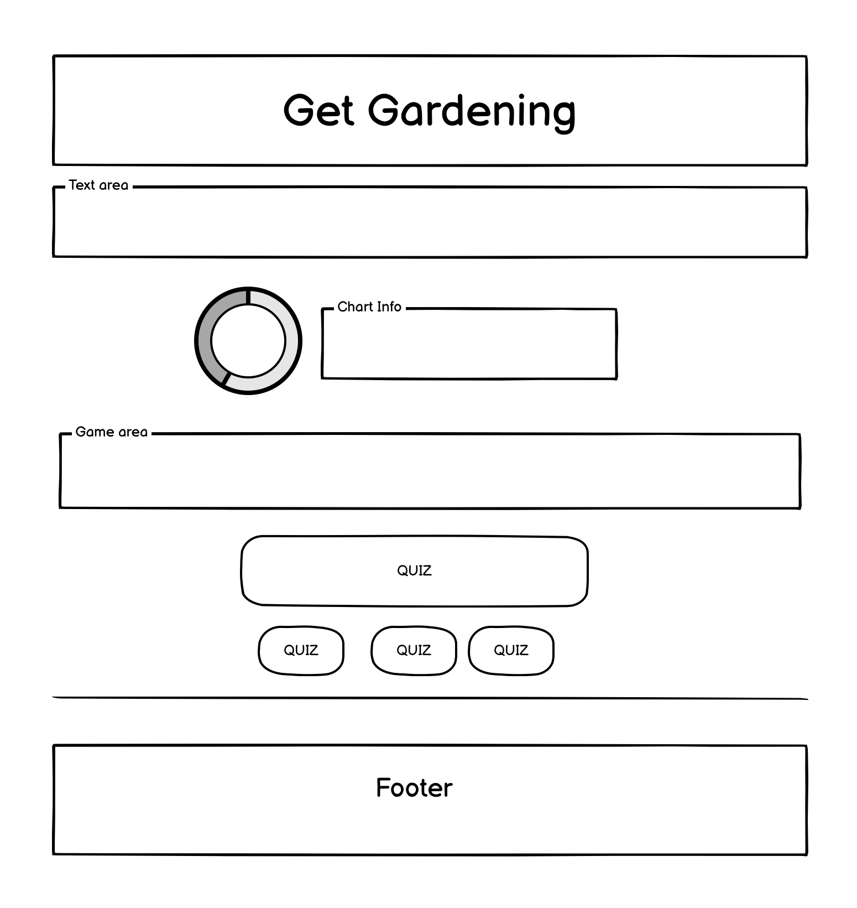
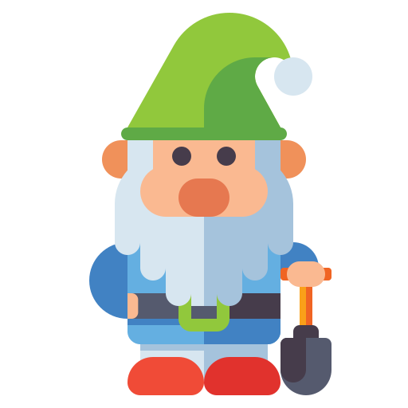
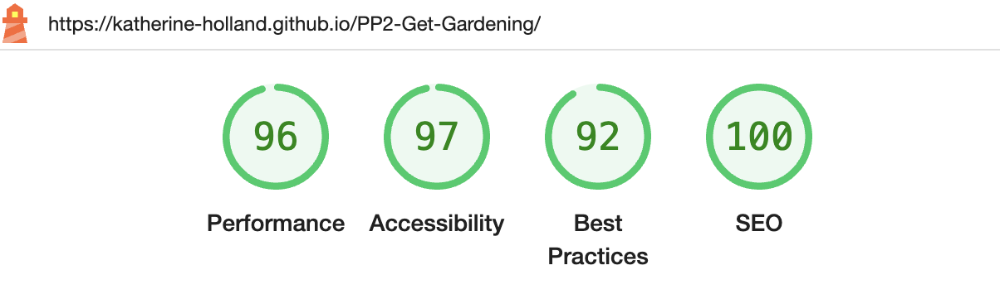
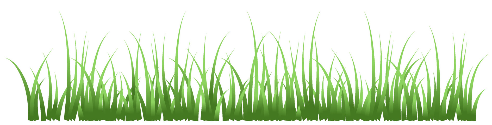

# PP2
Code Institute P2

# Get Gardening

A Code Institute Project (P2). Visit the live site [here](https://katherine-holland.github.io/PP2-Get-Gardening/)

Contents
1. [Introduction](#introduction)
2. [Design](#design)
3. [Features](#features)
4. [Manual Testing](#testing)
6. [Deployment](#deployment)
6. [Future Features](#future)
7. [Credits](#credits) 

## Introduction
**Audience:**
Get Gardening is a site aimed at a younger audience who want to learn about garden snails and play games.

**Client side:**
The site is designed to feel fun and informative.

## Design
The wireframe was created using Balsamiq. I created a basic structure.

### Colours

### Fonts
I used Google fonts and choose Noto Sans.

## Features
Below are the core functions and elements I incorporated into the site.

### Navigation Bar
I used Font Awesome to select my icons. I chose v4 icons to be compatible with the version I was coding with.
I decided to lay out my navigation, with the 'Home Page' in the far right corner and the 'Sign Up' page on the left. This was to allow 'Sign Up' to be more dominant, therefore encouraging users to sign up to the newsletter and to increase the likelihood of growing an email list quickly.
I also allowed the user to hover over the sections which would then change colour, I feel this helps to orient the user within the navigation.

### Game Over Button
I created a Game Over button which appears when the user loses the game.

### Images
I chose images that related to a fun gaming theme.

### Footer
I added a GIF to add interest to the footer and added the grass element to help set the scene.

## Deployment
I deployed the site via GitHub and gave detailed commits as the project progressed.

I tested it using two popular browsers, Chrome and Firefox, both of which worked well.
I then checked the site using Google Dev Tools testing the mobile responsiveness on all devices. The site worked well as I had used a container to add mobile responsiveness.

## Manual Testing
I used various methods to test the accessibility of my site and the quality of my code. The testing resulted in a number of error messages and suggestions which I took note of and implemented the necessary changes.

**W3Schools HTML Validator**
1. 
2. 

**Lighthouse**
1. 
2. I added alt text to my images as Lighthouse flagged up that they were not accessible to screen readers.

**W3 CSS Validator**
1. 

**JSHint**
1. 

## Future Features
1. I would create more characters that have different rules for speed and size.
2. I would add in harder levels as the game progresses. 
3. I'd create a share button to allow users to share the game with their friends.
4. I'd add in error handling when accessing DOM elements. Eg. the google charts api or any additional features for future editions.

## Credits
Special thanks to my Mentor Spencer Barriball and to Darragh Drennan for their support and guidance.

## Images:

Gnome png:  <a href="https://www.freepik.com/icon/christmas_10713384#fromView=search&page=2&position=91&uuid=f299468d-611a-472c-b1b4-3052a8f5781e">Icon by Paul J.</a>
Snail png: <a href="https://www.freepik.com/icon/snail_1998793#fromView=search&page=1&position=94&uuid=ac283b6e-e3a3-4246-b66f-a6583c5d678e">Icon by Flat Icons</a>
Grass jpg: 
**Plant GIF:**
<a href="https://lottiefiles.com/animations/plants-cGXbczhsoL?from=search">Plant GIF</a>

## Website Validators:
https://validator.w3.org/

https://jigsaw.w3.org/css-validator/

Google Dev Tools - Lighthouse

https://jshint.com/

## Tutorials & Advice:
https://www.w3schools.com/

Code Institute - Rock, Paper, Scissors, Stone Tutorial plus the Java Script Essentials module.

YouTube tutorial: https://www.youtube.com/watch?v=bG2BmmYr9NQ

**Google Charts:**
<a href="https://developers.google.com/chart/interactive/docs/quick_start">Piechart Tutorial</a> 

