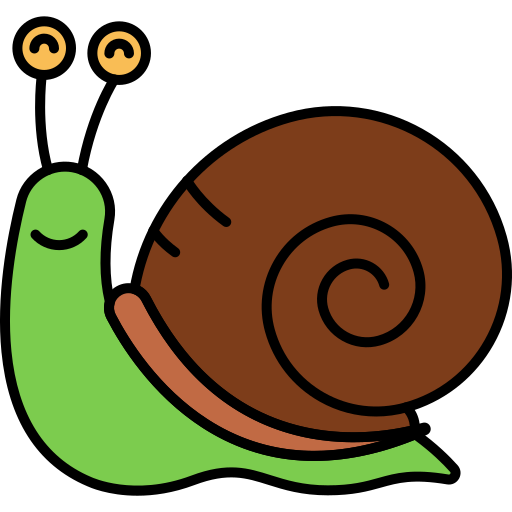

# PP2
Code Institute P2

# Get Gardening

A Code Institute Project (P2). Visit the live site [here](https://katherine-holland.github.io/PP2-Get-Gardening/)

Contents
1. [Introduction](#introduction)
2. [Design](#design)
3. [Features](#features)
4. [Manual Testing](#testing)
6. [Deployment](#deployment)
6. [Future Features](#future)
7. [Credits](#credits) 

## Introduction

**Audience** 
Get Gardening is a site aimed at a younger audience who want to learn about garden snails by playing themed games.

**Client side:**
The site is designed to feel fun and informative with simple activities and a link to more information on garden snails for those taking the quiz. This page would sit well within a larger educational website.

## Design
The wireframe was created using Balsamiq. I created a basic structure as I wasn't sure if I was going to be able to code both the quiz and the animated game in the timeframe.

### Colours
I used green and blue to represent the sky and the grass and kept the scheme simple. 

### Fonts
I used Google fonts and choose Noto Sans. I chose this font as it had a fun, rounded feel to it but was also still accessible and easy to read.

## Features
Below are the core functions and elements I incorporated into the site.

### Simple Game
I created a simple game inspired by the dinosaur game which appears when the internet is not working. The aim of the game is to jump as many obstacles as possible without hitting them. The dinosaur game used a timer but I decided to implement a jump counter and high score generator.

I found an online tutorial which re-created a similar functionality using blocks and I then modified this code with event listeners and graphics and more functionality to achieve the final snail game. As the coding progressed, I realised that this simple game was actually pretty difficult to code for a beginner and I was generating numerous errors as I went along (see 'Issues' below). However, I learnt a lot in the process!

### Snail Quiz
I created a simple quiz for children who wanted to learn more about snails. This game is followed by a link to the Natural History Museum's guide to snails, allowing the audience to find out more from an established authority on Natural History. This was created based around the topic on the Code Institute tutorial, using an array and a scoring system based on the correct answer being chosen.

### Images
I chose images that related to a fun gaming theme.
 

### Footer
I added a GIF to add interest to the footer and used a green horizontal rule to denote grass and to break up the page.

## Deployment
I deployed the site via GitHub and gave detailed commits as the project progressed.  I did this on the 'pages' section via the repository 'settings' tab. Under the 'source' drop down menu, I deployed from branch, ensuring the 'root' folder was selected before saving it. Under the green 'code' button, within the repository, the URL link is shown and I copy pasted into the browser and IDE.

I tested it using two popular browsers, Chrome and Firefox, both of which worked as expected.

I tested the site using Google Dev Tools both for desktop and for mobile responsiveness on all devices. The site worked well as I had used a container to add mobile responsiveness, however, I did need to change the chart dimensions in the jsscript file to allow it to fit on smaller mobile screens.

## Manual Testing
I used various methods to test the accessibility of my site and the quality of my code. The testing resulted in a number of error messages and suggestions which I took note of and implemented the necessary changes.

**W3Schools HTML Validator**
1. 
2. 

**Lighthouse**
1. 
2. I added alt text to my images as Lighthouse flagged up that they were not accessible to screen readers.

**W3 CSS Validator**
1. 

**JSHint**
1. 

**JS Issues**
As this language was new to me, I had a steep learning curve and there were many issues during the build.
1. During testing I realised that the js script wasn't correctly loading from the assets folder.

   
2. Upon testing the game feature, my Mentor pointed out that the spacebar (used as the jump key) was causing the screen to scroll downwards, which is a default action. I rectified this by adding in a simple line of code to the "Keydown" event listener: event.preventDefault();
This solved the issue and resulted in a better user experience.

3. My event listener was checking for game over too quickly which caused the page to effectively freeze with the pop up constantly showing.
 

## Future Features
1. I would create more characters that have different rules for speed and size.
2. I would add in harder levels as the game progresses. 
3. I'd create a share button to allow users to share the game with their friends.
4. I'd add in error handling when accessing DOM elements. Eg. the google charts api or any additional features for future editions.

## Credits
**Fonts:**
https://fonts.google.com/

## Images:
**Wireframe:**
https://balsamiq.com/
**Mock Up:**
https://ui.dev/amiresponsive?url=https://katherine-holland.github.io/PP2-Get-Gardening/
Gnome png:  <a href="https://www.freepik.com/icon/christmas_10713384#fromView=search&page=2&position=91&uuid=f299468d-611a-472c-b1b4-3052a8f5781e">Icon by Paul J.</a>

Snail png: <a href="https://www.freepik.com/icon/snail_1998793#fromView=search&page=1&position=94&uuid=ac283b6e-e3a3-4246-b66f-a6583c5d678e">Icon by Flat Icons</a>

Grass jpg: 
**Plant GIF:**
<a href="https://lottiefiles.com/animations/plants-cGXbczhsoL?from=search">Plant GIF</a>

**Dino game visual for README:** 
Anand Krish, CC BY-SA 4.0 <a href="https://creativecommons.org/licenses/by-sa/4.0">, via Wikimedia Commons

## Website Validators:
https://validator.w3.org/

https://jigsaw.w3.org/css-validator/

https://jshint.com/

Google Dev Tools - Lighthouse

## Tutorials & Advice:
https://www.w3schools.com/

Code Institute - Rock, Paper, Scissors, Stone Tutorial plus the Java Script Essentials module.

YouTube tutorial: https://www.youtube.com/watch?v=bG2BmmYr9NQ

**Google Charts:**
<a href="https://developers.google.com/chart/interactive/docs/quick_start">Piechart Tutorial</a> 

Special thanks to my Mentor Spencer Barriball for his support and guidance.